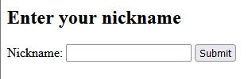

# &lt;nickname-form&gt;

A webcomponent representing an input form where the user can input their username that is then stored in a constant called nickname

## Example

```html
<nickname-form></nickname-form>
```

